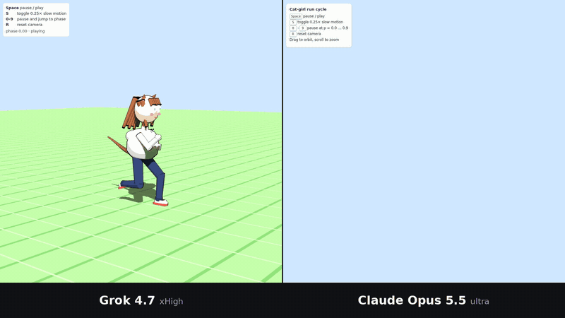
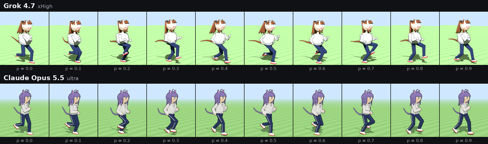

# Same prompt. One shot each. Grok 4.7 vs Claude Opus 5.5.

*By [@NegevTV_](https://x.com/NegevTV_) on X*



I gave two frontier models the exact same (long, annoyingly specific) prompt: **build a 3D anime cat-girl from scratch and make her run in a perfect loop, all in one HTML file.** No 3D models, no textures, no images. Just code and math.

One shot each. No retries, no edits, no "let me regenerate that real quick."

**Left:** Grok 4.7 (xHigh). **Right:** Claude Opus 5.5 (ultra).

I'm not gonna tell you what to think. You have eyes.

### ▶ [Play with both live, side by side](https://negevtvx.github.io/grok-vs-opus-catgirl-run/)

It runs right in your browser, nothing to install. Click a side, then hit <kbd>Space</kbd>, <kbd>S</kbd>, <kbd>0</kbd>–<kbd>9</kbd> or <kbd>R</kbd>. The keys fire on both sides at once. Drag to spin the camera, scroll to zoom.

Or open them one at a time: [Grok 4.7](https://negevtvx.github.io/grok-vs-opus-catgirl-run/outputs/grok-4.7-xhigh.html) · [Claude Opus 5.5](https://negevtvx.github.io/grok-vs-opus-catgirl-run/outputs/claude-opus-5.5-ultra.html)

---

## "You cherry-picked." No I didn't. Receipts:

- **The exact prompt:** [`prompt.txt`](prompt.txt), word for word.
- **Both raw outputs:** [`outputs/`](outputs). The files are byte for byte what each model returned. I only renamed them.
- **SHA-256 hashes** are at the bottom, so you can check I didn't touch shit.
- **The side-by-side video** ([`media/side-by-side.mp4`](media/side-by-side.mp4)) was recorded with identical inputs hitting both pages on the same frames. Same slow-mo, same pause, same camera drags, same zoom, same everything.

Don't trust me. Download the files and run them yourself.

## What the prompt actually asked for

The long version is in [`prompt.txt`](prompt.txt). The short version:

- One self-contained HTML file on Three.js r160. No other libraries, and every mesh built in code.
- A real skeleton: pelvis → spine → chest → neck → head, plus arms and legs with proper joints.
- Anime proportions, about 4 heads tall, cute but not chibi.
- Shoulder-length hair with blunt bangs (10+ separate clumps), cat ears with pink insides, and a tail with 10+ segments.
- Big anime eyes with highlights, blush, an oversized hoodie, track pants, white sneakers with red soles.
- Toon shading with black outlines.
- A run cycle that loops perfectly: flight phase, body bob, hips and torso counter-rotating, arms swinging, a stable head, bouncy ears, a tail with follow-through, and hair that lags behind.
- A ground that scrolls at exactly the foot's speed, so her feet don't slide.
- Controls for pause, slow-mo, phase jumps and camera reset.

That's a lot to get right in one shot. Watch the video and see who actually did it.

## Stuff worth noticing

- **The hair.** Grok built the bangs out of what are basically little wooden planks. Opus went with actual tapered hair clumps, side locks and an ahoge.
- **The face.** Grok's head is a big smooth ball with the eyes stuck on the front. Opus painted a full anime face onto a head with an actual jawline.
- **The tail.** Grok's looks like it came off a rat. Opus's looks like it came off a cat.
- **The outfit.** Opus added side stripes on the track pants and "sleeve paws" on the hoodie, and nobody even asked for those.
- **Credit where it's due.** The prompt had a `{{HAIR_COLOR}}` placeholder that never got filled in. Both models caught it and picked a color themselves: Grok went auburn and Opus went lavender. Both files also run with **zero console errors**, so Grok's isn't broken. It's just like that.
- **Another point for Grok:** its camera has smooth damping when you orbit. Opus's doesn't.

## Facts, no vibes

| | Grok 4.7 (xHigh) | Claude Opus 5.5 (ultra) |
|---|---|---|
| File size | 25,075 bytes, 763 lines | 42,210 bytes, 770 lines |
| Console errors or warnings (headless Chromium) | 0 | 0 |
| Hair color picked for `{{HAIR_COLOR}}` | `#a15c38` auburn | `#8e7cc3` lavender |
| Hair pieces | 15 box/cylinder clumps | 19 spline-tube clumps (ahoge included) + 2 scalp caps |
| Tail segments | 12 | 12 |



<details>
<summary>How the video was recorded (for the nerds)</summary>

- Both pages ran in headless Chromium at 960×960 on Playwright's fake clock. Time moved forward in exact 1/60 s steps, with one frame captured per step. That keeps the two halves in sync to within a frame or two. The only slack is exactly when an input event lands relative to each page's animation frame.
- Every key press, mouse drag and scroll came from one script and hit both pages on the same frame. Any difference you see comes from the code itself.
- WebGL was software-rendered (SwiftShader) because the capture box had no GPU. On a real GPU both look a bit crisper.
- The capture box couldn't reach jsDelivr, so Three.js was served locally from the official `r160` tag of the three.js repo. That's the same release the import map points to.
- Yes, Claude helped put this repo together (the recording script, this README and the side-by-side page). Yes, that's a conflict of interest, which is exactly why the raw files and hashes are right here. The two model outputs themselves are untouched.

</details>

## Hashes

```
e00ddb6ddeaff8ef4da5e109d7061617eba09fc1b11217b9acc5ef4f441d9556  outputs/grok-4.7-xhigh.html
9339d917fd8bc502dd1b50114ae9115ae8fdc92acaf811e0a82384ffb16bb7bf  outputs/claude-opus-5.5-ultra.html
c20bb0d0aaf1a554a41f27b8f818b6ef139e5cb104e1829459bd20bb0ec14ae3  prompt.txt
```

---

If this made you laugh, drop a star. Want another round with a different prompt or other models? Open an issue, or yell at me on X: **[@NegevTV_](https://x.com/NegevTV_)**.
